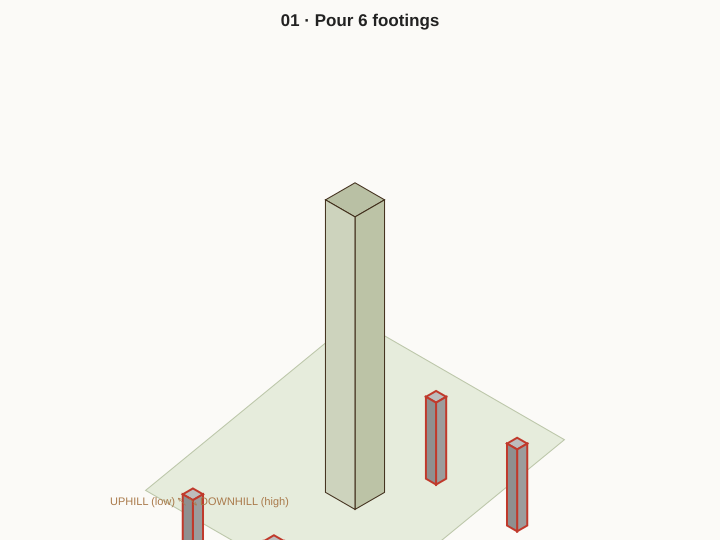
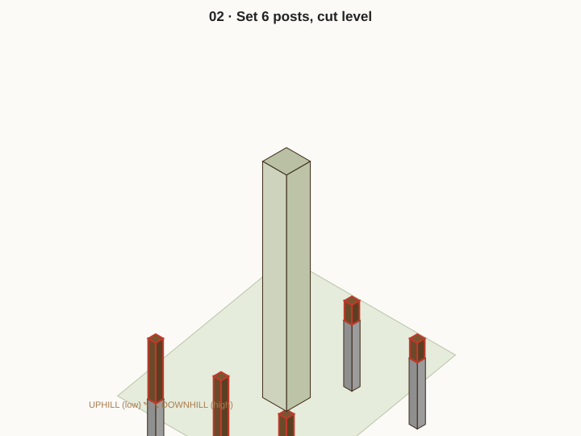
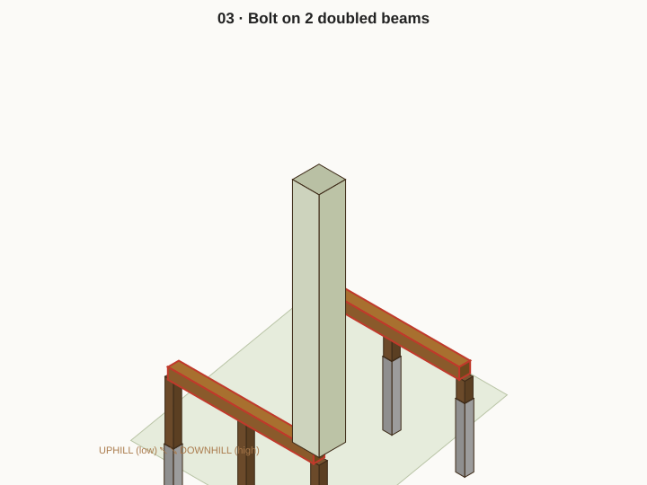
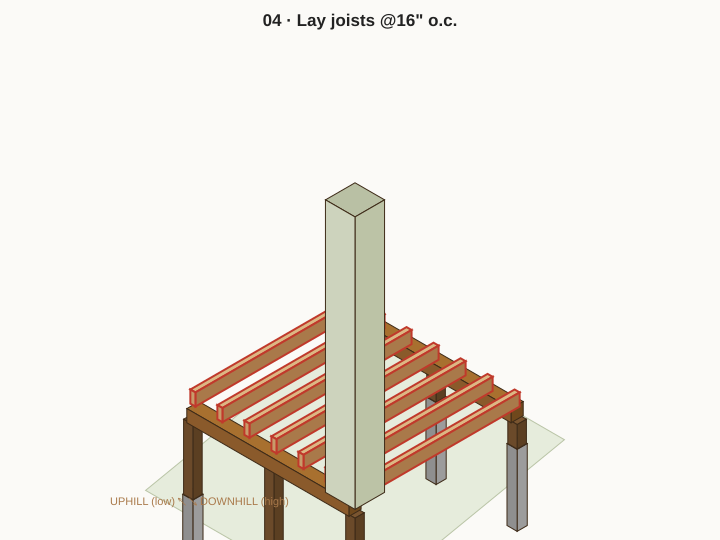
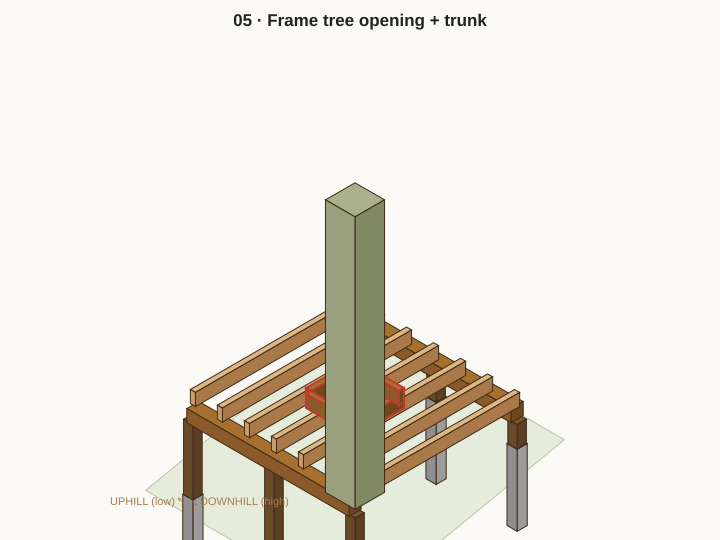
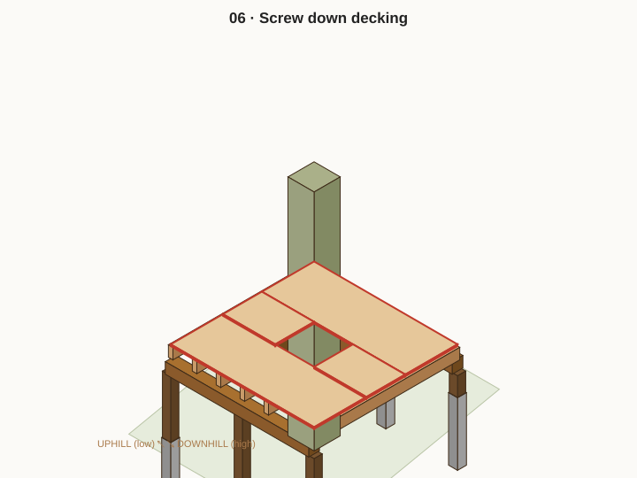
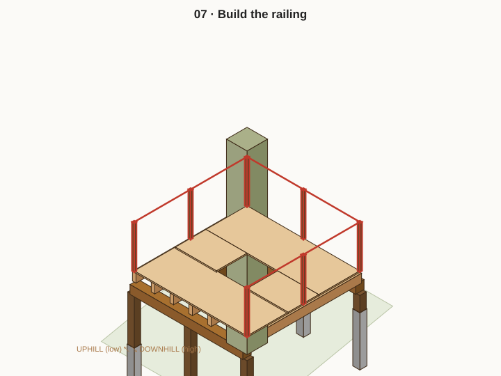
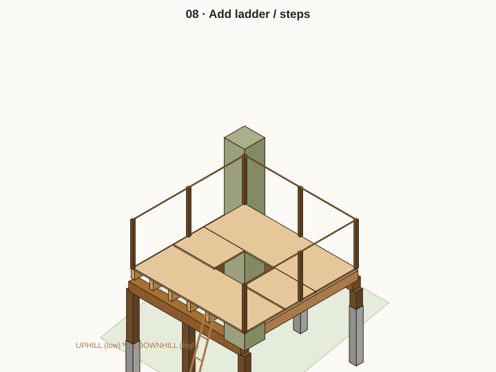

# Step-by-step build guide (with 3D drawings)

Eight steps, footings → finished. Each step has a 3D drawing in `../plans/` (the new part is
highlighted in **red**). For a live, rotatable version where you can change the tree diameter,
slope, and heights, open **`../plans/model3d.html`** in a browser.

> Numbers below are for the locked Phase-1 design: **8×8 platform, 17.5" trunk, 15° slope.**
> If you change anything, re-run `node plans/gen.mjs` and read the live numbers in the 3D model.

---

## ☐ Step 1 — Footings

Dig and pour the 6 piers. This is the only step that's hard to redo, so take your time.

- [ ] Stake the 8×8 footprint; check it's square (measure both diagonals — equal = square)
- [ ] Dig 6 holes on the **0 / 48" / 96"** grid, two rows (uphill + downhill), ~**42" deep** (below frost)
- [ ] Gravel in each hole bottom for drainage
- [ ] Set 10–12" tube forms, pour concrete, embed a **Simpson ABU66** standoff base in each, plumb
- [ ] Let cure (24–48 hr) before loading

**Tip:** the standoff base keeps the post end off the ground = no rot. Get the bases roughly level to each other; small differences get trimmed out at Step 2.

---

## ☐ Step 2 — Posts

- [ ] Stand a 6×6 in each base, plumb, and brace temporarily
- [ ] Mark ONE level line around all 6 posts (laser or water level) at the **beam-underside height (~12.5")**
- [ ] Cut all post tops to that line → this is what makes the deck dead-level on the slope
- [ ] Bolt posts into the bases

**Result:** uphill posts end up short (~12.5" exposed), downhill posts tall (~38.5" exposed). That difference IS the slope.

---

## ☐ Step 3 — Beams

- [ ] Build 2 doubled 2×8 beams (two plies bolted/screwed together)
- [ ] Set one on the uphill post line, one on the downhill line; bolt to posts with ½" carriage bolts
- [ ] Add 4×4 **knee braces** at 45° from each post to its beam (both directions on tall downhill posts)

**Why braces:** tall posts can rack sideways. Braces are what stop the whole thing swaying.

---

## ☐ Step 4 — Joists

- [ ] Lay 2×8 joists on top of the beams, **@16" o.c.**, running uphill→downhill
- [ ] Toe-screw or use hurricane ties at each beam
- [ ] **Leave the center two joists out where the tree opening will be** (next step frames it)

---

## ☐ Step 5 — Tree opening + trunk

- [ ] Frame the **26" × 26"** opening: doubled trimmer joists on left/right, doubled headers top/bottom, joist hangers at every cut end
- [ ] Confirm **~4" clear gap** all around the 17.5" trunk — never let framing touch bark
- [ ] See `../plans/05-tree-opening-detail.svg` for the exact framing

**Tip:** the gap is for growth + sway. Re-check it each spring; widen if the tree is closing in.

---

## ☐ Step 6 — Decking

- [ ] Screw down 5/4×6 deck boards with ~¼" gaps for drainage
- [ ] Notch the boards neatly around the trunk, keeping the gap
- [ ] Sand/ease any sharp edges

---

## ☐ Step 7 — Railing

- [ ] Bolt 4×4 rail posts to the rim joists
- [ ] Top + bottom rails at **36"** min height around the full perimeter except the entry
- [ ] Vertical 2×2 balusters with **no gap over 4"** (see `../plans/06-railing-detail.svg`)

**This is the safety step — don't skip the 4" rule.**

---

## ☐ Step 8 — Ladder / steps + finish

- [ ] Uphill side: 1–2 box steps (only ~28" to climb)
- [ ] Downhill side: ladder with handrails (the "fun" entry)
- [ ] Wobble test (jump on it), re-tighten every bolt, cap exposed threads
- [ ] Photos → `photos/`, tick off in `log.md`

🎉 Phase 1 done. Phase 2/3 upgrades (roof, walls, climbing wall, slide, rope bridge) are in `build-phases.md`.
